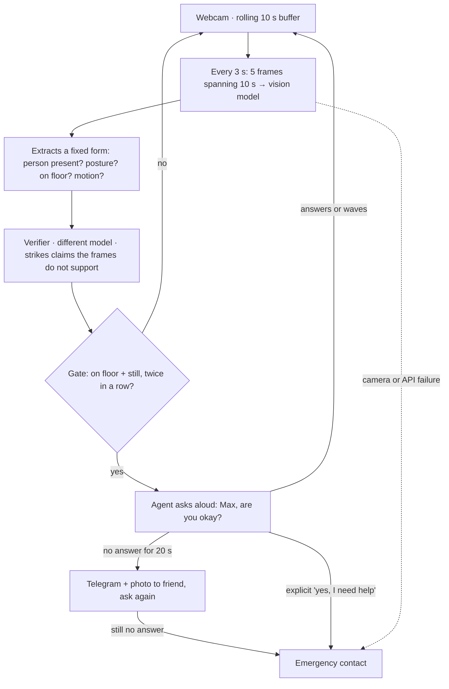

# Guardian — build plan

Read `AGENTS.md` first, especially the Perception rules. This document is the plan and the
order of work. Every step has a verification gate: **do not start the next step until the
current one's check passes.**

---

## What we are building

A laptop camera watches a room. If someone ends up on the floor and stays there, the laptop
**asks out loud** — "Max, are you okay?" — **listens**, and only if nobody answers does it
**alert a friend over Telegram** with a photo from the camera.

The camera never alarms directly. It asks first. A false alarm costs one spoken question,
not a panicked phone call to a family member.

> **Not a medical device.** Detects potential safety events and asks whether the person
> needs help. Does not diagnose medical conditions. Keep this framing in every prompt, log
> line and piece of copy.

## How it works



**Three rules live in plain code, never in a prompt:**
1. The gate needs two confirmations in a row.
2. The emergency contact is reached only after two unanswered attempts or an explicit yes.
3. Any failure — camera drop, API error, malformed response — **escalates**. A monitoring
   system that fails silently is worse than none, because it is trusted.

**The vision model extracts; it never judges.** It is never asked "did the person fall?" —
that is an event it cannot observe at 3-second sampling and a judgment that belongs to the
gate. It reports `posture`, `on_floor`, `visible_motion`, and the evidence for each.

No `fell?` field. No confidence score.

## Stack

| Piece | What | Notes |
| --- | --- | --- |
| Machine | One laptop, Python + uv | **Decide Mac or Windows today** — TTS and paths differ |
| Eyes | Webcam + OpenCV | 5 fps into a rolling 10 s buffer |
| Seeing | OpenAI vision, thinking off, `detail: low`, 512px | 5 frames spanning 10 s, every 3 s |
| Checking | Different model via OpenRouter, **text only** | Gets the form and its evidence, never the images |
| Deciding | Plain Python | Two confirmations, cooldown, failure escalates |
| Talking | OS speech synthesis | One scripted line, blocking |
| Listening | **Wave or button first**, speech as a bonus | A noisy venue makes STT a coin flip |
| Alerting | Telegram bot | Message + webcam photo |
| Memory | SQLite | Contacts and a replayable event log |
| Settings | `.env` + config | Timings separate from personal data separate from secrets |

---

# Steps

## Step 0 — Prove the foundations · 15 min

No application code. Confirm what everything else sits on.

- Confirm the exact vision and challenger model ID strings the API actually returns.
- Capture test fixtures from the webcam.
- Confirm the camera keeps running when the screen dims.

```bash
uv run python scripts/verify_env.py
uv run python scripts/capture_fixtures.py     # keys: 1 stand 3 lying-floor 5 wave 6 empty
uv run python scripts/try_observer.py
```

**PASS when:** `verify_env` shows OK for OpenAI, OpenRouter and Telegram; `try_observer`
returns valid JSON for every fixture, with `posture: lying, on_floor: true` on
`lying_floor_1.jpg` and `posture: standing` on `standing_1.jpg`.

**If it fails:** the model ID is wrong, or the prompt needs tightening in
`prompts/observe.md`. Fix it here. Do not build on a perception layer that is guessing.

---

## Step 1 — Camera and rolling buffer · 30 min

`src/camera.py` — capture at 5 fps into a deque holding the last 10 seconds. A
`sample()` method returns 5 frames evenly spanning that window, each resized so the longest
edge is 512px, JPEG, base64.

**PASS when:**

```bash
uv run python -m src.camera --dump
```

writes 5 JPEGs to `tmp/`, they are visibly ~2.5 s apart, and each is ≤512px on the long
edge. Open them and look.

---

## Step 2 — Vision extraction, multi-frame · 40 min

`src/observer.py` — reads the prompt from `prompts/observe.md` (do **not** inline it), sends
the 5 frames in one call with `detail: "low"`, temperature 0, JSON mode, thinking off.
Returns the contract in `AGENTS.md`. Retry once on malformed JSON, then raise.

Because it now sees a time span, `visible_motion` is genuinely observable — say so in the
user message: "these 5 frames span the last 10 seconds, earliest first."

**PASS when:**

```bash
uv run python -m src.observer tests/fixtures/lying_floor_1.jpg
```

returns valid contract JSON, and every field has a matching entry in `evidence`. Check by
eye that nothing in `evidence` is an inference — no "appears unconscious", no "has fallen".

---

## Step 3 — The gate · 40 min  ← the only step provable without camera or network

`src/gate.py`, pure Python, no model calls in the file.

- `concern` when `on_floor` is true and `visible_motion` is `none`.
- `concern_streak` increments on concern, resets otherwise.
- Check-in begins only at `concern_streak >= 2` with no active cooldown.
- `still_for_seconds = concern_streak * SAMPLE_SECONDS`, derived here.
- Acknowledged → log, start cooldown, resume.
- Window expires → escalate to friend, ask again, then emergency contact.
- **Any exception → escalate with the error text.**

**PASS when:**

```bash
uv run pytest tests/test_gate.py -v
```

passes with tests covering: one concern sample does not escalate · two consecutive do ·
acknowledgement cancels and starts cooldown · cooldown suppresses re-trigger · an exception
escalates. No network, no camera, runs anywhere.

---

## Step 4 — Speak · 20 min

`src/voice.py` — blocking `speak(text)` through the OS speech engine. One line:
"Max, are you okay? Please wave at the camera."

**PASS when:** you hear it through the laptop speakers, **and** a 10-second OBS recording
with system audio captured plays it back clearly. Test the recording, not just the speaker —
inaudible demo audio is the most common way a hackathon video fails.

---

## Step 5 — Acknowledgement · 30 min

Multi-modal on purpose. During the check-in window, poll every 2 s:
- a wave, via `is_acknowledging()` in the observer (same model, different prompt), **and**
- a key press in the overlay window.

Speech recognition only if steps 0–7 are green and time remains.

**PASS when:** during a check-in, waving at the camera logs `resident_responded` and
returns to watching; pressing the key does the same; doing neither lets the window expire.

---

## Step 6 — Telegram escalation · 30 min

`src/notify.py` — `sendPhoto` to `TELEGRAM_CAREGIVER_CHAT_ID`: the frame, plus a caption
with timestamp, the observation fields, struck claims shown struck through,
`still_for_seconds`, and why it escalated (no response / pipeline error).

**PASS when:**

```bash
uv run python -m src.notify --test
```

puts a photo and a readable caption on the caregiver phone within five seconds.

---

## Step 7 — End to end · 40 min

`src/main.py` wires the loop. `src/overlay.py` draws state onto the OpenCV frame — current
state, concern streak, the evidence booleans, and a large countdown during check-in. **No
Streamlit.** This is what gets filmed; make it readable at video resolution.

Wrap the observe and verify calls with `@timed` from `src/obs.py`.

**PASS when:** both scripted runs work back to back without touching the keyboard —
(a) person goes to floor, stays silent, friend gets the Telegram photo;
(b) person goes to floor, waves, overlay reads `RESOLVED — no alert sent`.

**This is the demo. Everything after this is upside.**

---

## Step 8 — The Verifier · 30 min · SHOULD

`src/verifier.py` — calls `CHALLENGER_MODEL` on OpenRouter, **text only, never the images**.
Returns `{"struck": [...]}` naming fields or notes the `evidence` array does not support.

One extra call, and the single thing that separates this from every other fall-detection
project. Do not skip unless genuinely out of time.

**PASS when:** given a hand-written observation containing "the person appears to be
unconscious" with evidence only "torso is horizontal on the floor", the verifier strikes it.
Keep that case as `tests/test_verifier.py`.

---

## Step 9 — Escalation ladder · 30 min · SHOULD

Second attempt after the first unanswered Telegram, then the emergency contact. Explicit
"yes, I need help" jumps straight to the emergency contact.

**PASS when:** two unanswered check-ins reach contact two, and an explicit yes reaches it
immediately.

---

## Step 10 — Freeze, measure, record

**Feature freeze. No exceptions, including good ideas.**

```bash
uv run python -c "from src.obs import report; report()"
uv run python scripts/try_observer.py          # accuracy across fixtures
```

Write both numbers down before you start filming. Then follow
`04_Submission/video-script.md`.

---

# If-time only — start nothing here before the video is recorded

- Live realtime voice conversation with turn-taking and mic muting while speaking.
- Explicit-yes intent detection from speech.

**Realtime voice is the first thing to cut.** Turn-taking, echo suppression and mic muting
are a five-hour problem. The demo is just as strong with one scripted spoken line and a
wave back — and that version cannot fail on camera.

# Risks

- **Speech recognition in a room with sixty people is a coin flip.** Wave and button are the
  primary paths. The demo must not depend on speech.
- **The camera may stop when the screen sleeps.** Tested in step 0; fallback is dimming to
  zero rather than sleeping.
- **Echo — the laptop hearing itself.** Only a risk once live voice exists, which is why it
  is last.
- **The person must stay down long enough** for two checks plus latency. Rehearse once
  before filming.
- **Cost.** Five images every 3 s is ~6,000 images an hour. Log real token usage for ten
  minutes and multiply rather than assuming. If uncomfortable, move to 4–5 s sampling — it
  barely changes the demo and nearly halves the cost.
- **Frames of a person leave the machine.** Say so in the README: production would extract
  on-device and send only the derived booleans, and the architecture is shaped so that is a
  single component swap.
