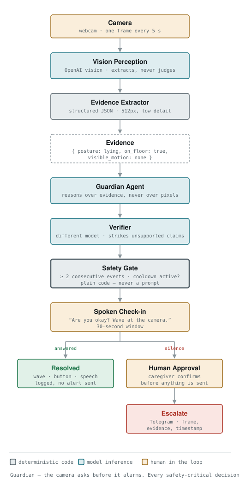

# Guardian

**A camera agent that asks before it alarms.**

Built in one afternoon for *Agents, Everywhere: Bots, Channels, & More* — OpenAI × AI Tinkerers, 12 September 2026.

> **Not a medical device.** Guardian detects potential safety events and asks whether the
> person needs help. It does not diagnose medical conditions.

---

## The problem

A camera in the room of someone living alone either records footage nobody watches, or
alarms so often that the family switches it off. The failure that matters isn't the missed
fall — it's the forty false alarms that destroy trust in the system.

Every existing product handles a false positive the same way: route it to a **human
call-centre operator** who phones in and asks "are you okay?".

## What Guardian does differently

It moves that verification step into the agent, and into the room.

**Detect → ask → listen → escalate only on silence.**

The camera decides nothing. It raises a question, the person answers it, and only silence
reaches a caregiver. Which means the detector is *allowed* to be imprecise — being wrong
costs one spoken question instead of a false alarm to someone's daughter.

**The pattern: the camera asks before it alarms.**

## Architecture



**Grey** = deterministic code · **teal** = model inference · **amber** = human in the loop.

Full rationale and trade-offs: [`docs/architecture.md`](docs/architecture.md)

Three decisions hold this together:

**1. The vision model extracts; it never judges.** It is prompted to describe only what is
visible and explicitly forbidden from inferring health, consciousness, intent, or whether
something is an emergency ([`prompts/observe.md`](prompts/observe.md)). It is never asked
"did the person fall?" — that is an event it cannot observe at 4-second sampling. It reports
posture, floor contact, motion, and the evidence for each.

**2. The safety gate is plain Python** ([`src/gate.py`](src/gate.py)). Two consecutive
concern samples plus a cooldown, both counters. A single frame can never raise an alarm,
and `still_for_seconds` is derived in code, never claimed by a model. This is the only part
of the system that decides anything, and it is the only part with no network and no model —
which is why it is the part we can fully test.

**3. Failure escalates, it does not go quiet.** A dropped camera, a blocked lens, or a
failed API call notifies the caregiver with the error. A monitoring system that fails
silently is worse than none, because it is trusted.

That third rule was not theoretical. During the build the webcam was held by another
process, and the system refused to start rather than silently reporting an empty room.

## Quickstart

```bash
uv sync
cp .env.example .env          # Windows: Copy-Item .env.example .env
# fill in .env, then:
uv run python scripts/verify_env.py    # checks every key with one real call
uv run python -m src.main              # q in the overlay window to quit
```

`verify_env.py` prints a status table and never prints key material.

## The evidence contract

Every component reads or writes this shape. It was agreed before any code was written and
never renegotiated:

```json
{
  "person_visible": true,
  "posture": "lying",
  "on_floor": true,
  "visible_motion": "none",
  "scene_notes": ["chair overturned beside the person"],
  "evidence": [
    "torso is horizontal and in contact with the floor",
    "limb positions unchanged from the previous sample"
  ]
}
```

**No confidence score.** The model is not asked for one and could not calibrate it.
**No `fell?` field.** That is a judgment, and judgments belong to the gate.

## What's in here

| File | What it does |
|---|---|
| `src/camera.py` | 5 fps into a rolling 10-second buffer; samples 5 frames with their real time span; fails loudly on a blocked or missing camera |
| `src/observer.py` | Sends the 5 frames in one call, reads its prompt from `prompts/observe.md`, validates the contract |
| `src/gate.py` | The safety decision. Plain Python, no model calls, fully tested |
| `src/voice.py` | Speaks the check-in line |
| `src/notify.py` | Telegram escalation with the frame, the evidence, and the reason |
| `src/overlay.py` | The on-screen state, evidence booleans and countdown |
| `src/config.py` | Config and an OpenAI key pool that fails over on quota and rate-limit errors |
| `src/obs.py` | JSON logging and SQLite timing instrumentation |
| `scripts/verify_env.py` | One real call per service; never prints a key |
| `scripts/capture_fixtures.py` | Captures labelled test frames so perception can be tested without a camera |
| `scripts/try_observer.py` | Probes the vision model against a fixture |

## Tests

```bash
uv run pytest
```

The gate is the safety-critical component, so it is the one with real coverage — and it
needs no camera and no network, so it runs anywhere:

- one concern sample does not begin a check-in
- two consecutive do
- acknowledgement cancels and starts the cooldown
- cooldown suppresses a re-trigger
- an exception escalates rather than passing silently

## Known limits

Honest ones, because a monitoring system that oversells itself is the problem we set out to
avoid.

- Geometry catches a fall. It does not catch a slow decline — someone moving less over
  weeks, or no longer appearing in frame at their usual times. That is baseline deviation
  rather than event detection, and it is where the interesting product actually lives.
- The human-approval step is honest for a prototype and wrong for production: at 3 a.m.
  nobody is watching a screen. The real design is a tiered timeout, with approval reserved
  for higher-severity actions like contacting emergency services.
- **Frames leave the machine.** The prototype sends them to a hosted vision model.
  Production would extract on-device and send only the four derived booleans — the
  architecture is deliberately shaped so that is a single component swap, with everything
  downstream of the evidence contract untouched.
- Acknowledgement is a key press in this build; wave detection is wired but not enabled.

## Built during the hackathon

**Scaffolded beforehand** (permitted starter code): the uv project, environment config and
the OpenAI key pool, JSON logging and SQLite timing instrumentation, the Dockerfile, the
environment verification script, and the agent instruction file.

**Built on the day:** the camera buffer, the perception prompt and observer, the evidence
contract, the safety gate and its tests, the spoken check-in, the overlay, Telegram
escalation, and the architecture documentation.

## Prior art

[SafelyYou](https://www.safely-you.com/) does AI video fall detection in senior living.
[Vayyar](https://vayyar.com/) does it with radar. [ElliQ](https://elliq.com/) is a deployed
conversational eldercare companion doing proactive check-ins and medication reminders.

Detection is commodity and companionship is commercially served. Guardian's contribution is
narrower and, we think, the useful one: the **verification loop** — the agent resolving its
own uncertainty by asking the person, instead of routing every false positive to a human
operator.

## Licence

MIT.
