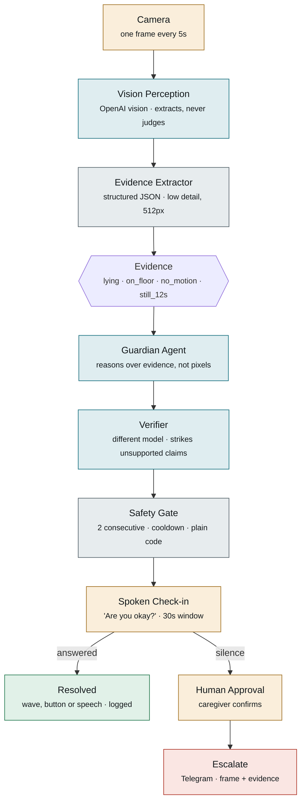

# Guardian — architecture

> Not a medical device. Detects potential safety events and asks whether the person needs
> help; it does not diagnose medical conditions.

## Problem

Camera monitoring for people living alone either records footage nobody watches, or alarms
so often that the family switches it off. The failure that matters is not the missed fall —
it is the forty false alarms that destroy trust in the system.

## Channel, and why it is load-bearing

The agent lives in the physical room: it has the camera's view and a speaker to talk back
through. Remove it from that room and there is nothing to observe and nobody to ask.

## The pattern

**The camera asks before it alarms.** Detection raises a question, not an alarm. The person
resolves the uncertainty. Escalation happens only when nobody answers.

## Flow



Grey nodes are deterministic code. Teal nodes are model inference. Amber nodes involve a
human. Every safety-critical decision sits in a grey node: the models describe and reason,
they never decide what the system is permitted to do.

## The integration contract

Agreed at minute 20, never renegotiated. Every component reads or writes this shape:

```json
{
  "person_visible": true,
  "posture": "lying",
  "on_floor": true,
  "visible_motion": "none",
  "scene_notes": ["chair overturned beside the person"],
  "evidence": [
    "torso is horizontal and in contact with the floor",
    "limb positions unchanged from the previous sample"
  ]
}
```

`still_for_seconds` is **not** in this payload. It is derived by the gate as
`concern_streak * SAMPLE_SECONDS` — computed in code, never claimed by the model.

No confidence score. The model is not asked for one and could not calibrate it; an invented
probability is exactly the unsupported claim the Verifier exists to strike.

### Why the model extracts rather than judges

The vision model is prompted to describe **only what is visible**, and explicitly forbidden
from inferring health, consciousness or intent. If it were asked "is this an emergency", the
safety decision would sit inside a prompt, the gate would own nothing, and the Verifier
would have no independent claim to check. Extraction keeps all three rules intact.

There is no `rapid_descent` field. At 3-5 second sampling the fall itself is not observable,
only its aftermath. Claiming otherwise would be an unsupported claim in our own contract.

## Four claims this design makes

1. **A single frame can never raise an alarm.** The gate requires the event to persist
   across at least two consecutive samples and respects a cooldown. Both are counters in
   plain Python — bounded, testable without a camera.
2. **The model reasons over evidence, not pixels.** Pose geometry produces structured
   booleans; the agent receives those. More defensible than asking a vision model whether
   someone is having a medical emergency, and it is why the system can explain itself.
3. **The person resolves the uncertainty, not the algorithm.** A detector that is wrong 40%
   of the time is still useful when being wrong costs one spoken question instead of a
   false alarm to a family member.
4. **Failure escalates, it does not go quiet.** Camera drop or model error notifies the
   caregiver with the error text. A monitoring system that fails silently is worse than no
   system, because it is trusted.

## Trade-offs taken

| Decision | Bought | Paid |
|---|---|---|
| Hosted vision for perception, not on-device pose | No install risk; scene understanding (overturned chair, obstacles) a pose skeleton cannot see | Network on the safety path; frames leave the home; cannot observe the fall itself, only its aftermath |
| Model extracts evidence, gate decides | Safety decision stays in plain code; Verifier has concrete claims to check | Extraction quality varies between samples; mitigated by requiring two consecutive |
| Check-in before escalation | False-positive cost drops from "alarm a family" to "ask a question" | Adds 30 seconds before a real emergency reaches anyone |
| Multi-modal acknowledgement (wave / button / speech) | Works in a noisy room; no dependency on speech recognition | A wave can be accidental; not a strong identity signal |
| Human approval before sending | Nothing irreversible happens autonomously | Needs someone watching — the weak link at 3 a.m. |

## Privacy — the cost of hosted perception

The prototype sends frames to a hosted vision model. On-device pose extraction would keep
video in the home and send only derived booleans. The architecture is deliberately shaped so
that this is a **single component swap**: everything downstream of the evidence contract is
unchanged. Production would run extraction locally and let only the four booleans leave.

## What we would revisit first

The human-approval step is honest for a prototype and wrong for production: at 3 a.m. nobody
is watching a screen. The real design is a tiered timeout — notify the caregiver's phone
automatically once the check-in fails, and reserve human approval for higher-severity
actions such as contacting emergency services. The approval gate moves up the severity
ladder; it does not disappear.

Second, the detector's blind spot. Geometry catches a fall. It does not catch a slow
decline — someone moving less over weeks, or no longer appearing in frame at their usual
times. That is baseline deviation rather than event detection, and it is where the
interesting product actually lives.

## Measured result

TODO — fill from `runs.db` via `src/obs.py report()` before submitting.
